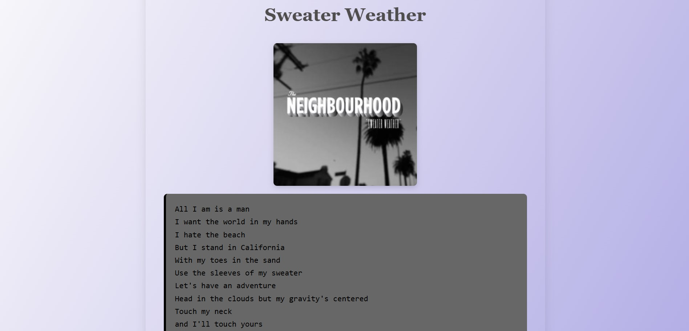

# Web Scraping Projects 🕷️

This repository contains basic web scraping projects built with Python using libraries like `requests`, `BeautifulSoup`, and more. As a college student, this is part of my journey to explore data extraction, HTML structure, and automation.

---

## 🧠 What You’ll Find Here

- `web_scraper.py` — A Python script to scrape article titles from websites (e.g., Blackcoffer).
- `headers.py` — For storing request headers to avoid detection.
- `index.html` — A beautiful static HTML page with styled lyrics.
- `album_cover.jpg` — An album art image used in the `sweater_weather.html` file.

---

## 🎨 Sweater Weather HTML Page

A fun side project to experiment with HTML and CSS layout.


### 🖼️ Screenshot:



---


### Sweater Weather HTML:

1. Open `sweater_weather.html` in any browser.
2. Ensure `album_cover.jpg` is in the same folder.
3. Or deploy using GitHub Pages for a live view.

---

## 📚 Requirements

* Python 3.x
* `requests`
* `beautifulsoup4`

Install dependencies:

```bash
pip install -r requirements.txt
```

---
## 📂 Folder Structure

```
web-scraping/
│
├── scraper.py
├── headers.py
├── sweater_weather.html
├── cover.jpg
└── README.md

---

## 🙋‍♂️ About Me

Just a student exploring Python, scraping, and the web.
Looking forward to building more projects!


